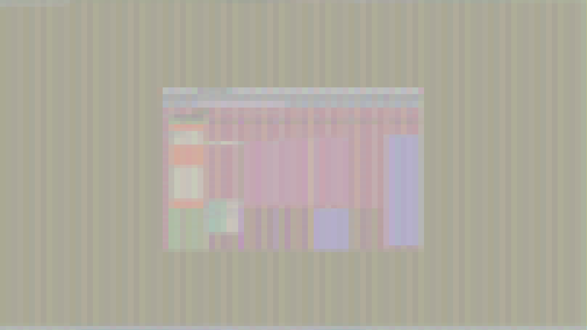

# go-swaylock-ecb
AES-ECB encrypted screenshots for all outputs as a background for swaylock. 

When executed, the program will take screenshots using `grim`, encrypt them AES-128 in ECB mode and run `swaylock` with the encrypted screenshots as wallpapers for each output.

For more information on how this works and why it is cool, please read [The ECB Penguin by Filippo Valsorda](https://words.filippo.io/the-ecb-penguin/).

## Dependencies
- [go](https://github.com/golang/go)
- [swaylock](https://github.com/swaywm/swaylock)
- [grim](https://sr.ht/~emersion/grim/)

## Installation
TODO

## Usage
Execute `go-swaylock-ecb` to lock your screen. 

## Example sceenshot

